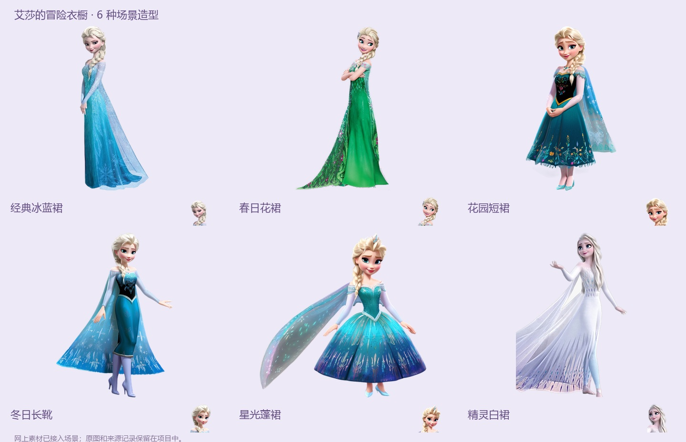

# 艾莎的冰雪奇遇

电脑浏览器里的幼儿英语魔法冒险，Phaser 4.2.1 + TypeScript + Vite。家长选关、点一次开始并允许麦克风后，孩子跟着说话，场景自动回应并继续。每关预计约 5～8 分钟，取决于孩子的跟读和重试节奏。没有发音分数和倒计时。

**换电脑 / Codex 接手：先读 [交接文档](docs/HANDOFF.md) 和 [AGENTS.md](AGENTS.md)。** 完整游戏美术与 MiniMax MP3 随仓库提供，首次试玩无需 API 密钥。需要 Git 和 Node.js 22 或更新版本。

## 开始试玩

PowerShell：

    git clone https://github.com/linbainian/elsa-english-adventure.git
    cd elsa-english-adventure
    npm ci
    npm run dev

打开 http://127.0.0.1:5173 ，选择想玩的关卡，点击“开启冒险”。建议本机 Edge 或 Chrome，通过 localhost / HTTPS 使用麦克风。

中文语音引导 → 英文情境句和慢速跟读 → 麦克风亮起 → 孩子说完稍停一下 → 魔法动作和英文表扬 → 中文结果反馈 → 自动继续。进入关卡后不用触碰电脑。家长的暂停、设置、冒险手册保留在顶部。

## 已实装的关卡

| 关卡 | 主题与长度 | 场景和玩法 |
| --- | --- | --- |
| 1 艾莎的新朋友 | 问候与礼貌新手情景，13 步 | 认识雪宝 / 拜访冰雪城堡 / 新朋友欢迎派对，打招呼、收礼物、礼貌开门、邀请猫头鹰、合影与道别 |
| 2 身体动一动 | Big Fun 1 · Unit 2 My Body，13 步 | 水晶洗漱室 / 泡泡音乐房 / 云朵舞台，躲猫猫、吹泡泡、拍手点灯、彩色脚印和身体舞 |
| 3 我的家庭 | Big Fun 1 · Unit 3 My Family，13 步 | 暖木客厅 / 绿色蘑菇花园 / 星光照相馆，拥抱、拆礼物、故事蝴蝶、野餐、全家福 |
| 4 玩具城堡 | Big Fun 1 · Unit 4 My Toys，13 步 | 惊喜玩具屋 / 齿轮火车站 / 彩虹游行街，弹球、抱抱、转圈、积木搭桥、汽车试路、火车载客与玩具游行 |
| 5 艾莎的魔法衣橱 | Big Fun 1 · Unit 6 My Clothes，13 步 | 魔法衣橱 / 花园试衣亭 / 星光舞会，换裙子、穿鞋戴帽、镜子搭配、外套挡雨、星光舞步、装扮照片与舞会 |
| 6 动物救助站 | Big Fun 1 · Unit 7 Animals，13 步 | 彩虹救助站 / 泡泡水塘 / 月光动物营地，叫醒、叼球、躲猫猫、飞翔、划水、泡泡观察窗、梳毛、甩水、安睡与动物派对 |
| 7 艾莎的魔法小镇 | Big Fun 1 · Unit 8 My World，16 步 | 晨光巴士街 / 泡泡玩偶诊所 / 星光感谢广场，车票与载客、水花风车、陪小鸭过街、心跳、软毯、玩具牙齿与感谢伙伴 |

各关复习穿插在不同剧情动作里。词汇、句型、NPC 台词和结局围绕一个主题。Big Fun 关卡是按官方主题原创改编，家庭称呼、部分词汇和句型有所调整，不代表完整覆盖教材。第八关 My Lunch、第九关 My Class 在路线图中，尚未开放。

玩法、美术、音频详情见 [docs/theme-levels.md](docs/theme-levels.md)，实际画面见 docs/previews/。资源包含 6 张有明显场景差异的新背景、团团 6 个姿态、5 位家人和 7 个道具，共 24 张新美术资源。

第四章另有 3 张背景、6 个透明玩具、1 节配套车厢和 57 条新 MiniMax 语音，详情见 [docs/chapter-4.md](docs/chapter-4.md)，三幕画面见 docs/previews/toy-worlds.jpg。

第五章有 3 张背景、6 套穿戴服装、鞋帽等道具，共 17 个美术资源和 56 条新 MiniMax 语音。衣服会直接改变主角的造型并跨幕保留，镜子和照片展示当前搭配。详情见 [docs/chapter-5.md](docs/chapter-5.md)，三幕画面见 docs/previews/wardrobe-worlds.jpg。

第六章有 3 张背景、6 只动物、6 个专门姿态和 6 个道具，共 21 个资源与 57 段新 MiniMax 语音。动物朋友头像逐个点亮，重复词触发新的玩耍和照顾动作，小鱼在水塘 / 鱼缸里游泳。详情见 [docs/chapter-6.md](docs/chapter-6.md)，三幕画面见 docs/previews/animal-worlds.jpg。

第七章新增 29 个美术资源，三种空间和六位职业伙伴有明显差别，公交载客、风车、刷牙和毯子各有动作。此次同步重构新手关、缩短前面关卡的引导、修正衣橱问答和家庭介绍，共新增 127 段 MiniMax 录音。详情见 [docs/chapter-7.md](docs/chapter-7.md)，三幕见 docs/previews/community-worlds.jpg，七关检查见 [docs/level-review.md](docs/level-review.md)。

艾莎现有六种场景造型（五种新增服装）、两个新增蓝裙姿态和八张头像。场景自动换装，施法与欢呼保持当前服装，第五章仍由孩子语音搭配。来源和安排见 [docs/elsa-looks.md](docs/elsa-looks.md)。

## 语音与声音检测

- 所有人声只播放 MiniMax 离线生成的本地 MP3，用于示范、中文说明和反馈。英文目标有正常和慢速两版；浏览器语音合成已完全移除。录音缺失或播放失败时保持静音，可重试录音，运行时不调用云端。
- .env 中的 MINIMAX_API_KEY 只供 scripts/generate-voice.ts 使用，不进入前端。复制 .env.example 配置自己的本地凭据即可；已有资源播放无需密钥。
- getUserMedia + Web Audio 在本机检测声音活动，执行当前提示的动作。没有发音评测、词句识别、身体动作识别，也不上传或保存录音。
- 示范和反馈结束后再开麦，过场和暂停会停止接力。家长可在设置里选择“我读好了”或“键盘练习”试玩。

重新补齐台词（Node.js 22，已生成文件自动复用）：

    node --experimental-strip-types scripts/generate-voice.ts
    node --experimental-strip-types scripts/generate-voice.ts --dry-run

## 项目结构

| 文件或目录 | 用途 |
| --- | --- |
| src/game/level.ts | 主题定义、七个关卡的注册与声明式内容 |
| src/game/welcomeLevel.ts | 第一关问候和礼貌的故事步骤 |
| src/game/toyLevel.ts | 第四关 My Toys 的教学与故事步骤 |
| src/game/wardrobeLevel.ts | 第五关 My Clothes 的教学与换装步骤 |
| src/game/animalLevel.ts | 第六关 Animals 的教学、玩耍与照顾步骤 |
| src/game/communityLevel.ts | 第七关社区职业与礼貌帮忙故事 |
| src/game/Adventure.ts | 多关卡状态、推进和奖励 |
| src/game/SnowScene.ts | 场景、转场和旧关卡玩法 |
| src/game/ThemeDirector.ts | 身体 / 家庭主题的角色、道具和剧情动作 |
| src/game/ToyDirector.ts | 玩具主题的搭桥、载客与游行动作 |
| src/game/WardrobeDirector.ts | 主角换装、镜子、雨与彩虹、舞步、装扮照片 |
| src/game/AnimalDirector.ts | 动物姿态、玩球、飞翔、游泳、安睡与派对 |
| src/game/WelcomeDirector.ts、CommunityDirector.ts | 问候情景和职业伙伴的实际动作 |
| src/game/AnimatedActor.ts | 姿态渐变、角色呼吸和动作 |
| src/game/ElsaLooks.ts | 场景人物造型、纹理、手部／披风配置与头像 |
| src/game/feedback.ts | 鼓励与本次动作结果 |
| src/main.ts | 语音接力、界面、暂停、选关 |
| src/speech/ | 本机声音检测、本地语音播放、合成音效 |
| public/assets/body、family、themes | 新主题美术、清单和透明通道检查 |
| public/assets/toys | 第四关背景、透明玩具及清单 |
| public/assets/wardrobe | 第五关背景、服装、鞋帽及来源清单 |
| public/assets/animals | 第六关背景、动物、姿态、道具及来源清单 |
| public/assets/community | 第七关背景、职业伙伴、挥手姿态、道具及来源清单 |
| public/assets/audio | 本地 MP3、语音索引、生成报告 |
| docs/art-source、theme-art-prompts.json | 新素材原图及完整生成提示词 |
| docs/verification.md | 实际验证与边界 |

艾莎立绘包含现有 Wikipedia / PNGpix 图片及 PNG All / FreeIconsPNG 补充的公开素材，来源与署名见清单；新地图、雪兔角色和道具使用 image_gen 生成。旧混合冒险声明保留为 LEGACY_FOREST，已从可选关卡移除；其资源不删除。

## 构建和验证

    npm run build
    npm test
    npm run preview

Windows 自动化默认自动寻找本机 Microsoft Edge，配置见 playwright.config.ts；可用 PLAYWRIGHT_EXECUTABLE_PATH 指定浏览器路径，或安装 Playwright Chromium 并设置 PLAYWRIGHT_BROWSER=chromium。新电脑配置见交接文档。先构建，再测试静态版可避免热更新干扰：

    $env:PLAYWRIGHT_STATIC = '1'
    npm test

静态测试端口 5174，开发试玩端口 5173。测试包含第一关手动与纯语音流程、第二至第七关纯语音完整通关、三幕切换、载客 / 换装 / 飞行时暂停恢复、服装与动物状态保留和重玩复位、反馈与开麦互斥、真实 MP3 的暂停恢复和提示框边界。录音专项测试验证文件缺失、播放受阻、索引重试、异步加载时暂停和长台词完整播放，全程禁止访问浏览器语音合成 API。

自动化使用模拟声音活动，不代表真实 3 岁孩子或实物麦克风的试玩结果。实际儿童游玩仍需观察环境噪声、朗读节奏和兴趣反馈。
