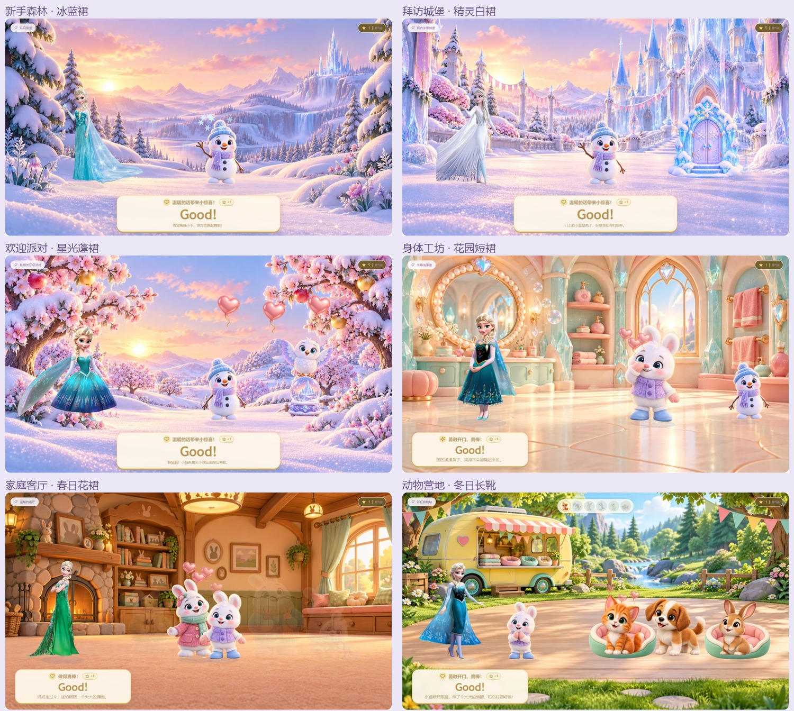

# 艾莎人物造型扩充

2026-10-05：在原有蓝裙基础上新增五套场景人物，另补充两个蓝裙全身姿态和八张裁切头像。全部来自公开网页下载；本次没有重新生成或重绘人物。

| 造型 | 出场安排 | 素材来源 |
| --- | --- | --- |
| 经典冰蓝裙 | 新手森林；保留第五关的原版脸部 | 原有素材；新增 [捧雪花](https://www.pngall.com/elsa-png/download/48261/) 和 [张臂欢呼](https://www.pngall.com/elsa-png/download/48326/) |
| 春日花裙 | 家庭客厅与花园、动物水塘、小镇诊所 | [Ahkâm / FreeIconsPNG](https://www.freeiconspng.com/img/42239) |
| 花园短裙 | 身体工坊与音乐室、玩具房、小镇街道 | [PNGpix](https://pngpix.com/png/elsa-frozen-fever-look-png-wpb-6uanpf3tyrz69n3d.html) |
| 冬日长靴 | 玩具车站、动物救助站与月光营地 | [PNGpix](https://pngpix.com/png/elsa-holiday-celebration-png-05212024-t1mtd8cfhbrcvzp2.html) |
| 星光蓬裙 | 新手欢迎派对、身体舞台、玩具巡游 | [PNGpix](https://pngpix.com/png/elsa-coronation-dress-png-ovh-gzb4tmgu52c9wag8.html) |
| 精灵白裙 | 新手城堡、家庭合影、小镇庆典 | [PNG All](https://www.pngall.com/elsa-png/download/48385/) |

一幕保持同一套衣服，在原有过场遮罩中换装。当前服装贯穿倾听、施法、欢呼和返回待机；新增素材没有独立的施法序列时，使用当前造型的手部与披风形变，避免动作过程中突然穿回蓝裙。手部形变位置、披风摆动方向随素材调整。对话头像使用实际人物头部裁切，不再从整张宽画布放大截取。新手结尾照片也使用当前造型并保留正确比例。

第五关仍由 `WardrobeDirector` 管理六套衣服、鞋帽和完整原版脸部，新场景造型不覆盖孩子正在搭配的衣服。结束后切入其他关卡，会恢复对应场景人物。

原始下载保存在 `docs/elsa-source-candidates`；生产素材在 `public/assets/elsa-looks`。`manifest.json` 保存每张素材的原图网址、页面、哈希、尺寸、透明范围、头部裁切和处理说明。规范化脚本为 `scripts/normalize-elsa-looks.py`，仅做透明范围裁切、预乘透明度缩放、对齐和头像裁切；人物统一 1024×512，身体中心在 x=512，落地在 y=500。白裙原图的披风左端已有源图边界，接入时保留所有供给像素，头部、手和脚完整。

选图按实际画面判断。没有采用标题写着艾莎却实际为安娜、手机图片、混合多人、嵌入棋盘格、半身截断或带水印的文件。PNGpix 的部分图为 CG 风格整理／再创作，页面名也与服装不符，因此星光蓬裙没有被称为电影原版加冕服。

人物版权属于 Disney；本站整理图不标为 CC0 或电影官方资源。来源页列出个人用途或非商业用途。本项目按用户明确要求用于个人作品。FreeIconsPNG 要求的 Ahkâm / FreeIconsPNG 署名已放入游戏家长设置中的「人物素材出处」。

实际游戏预览和浏览器异常检查保存在 `docs/previews/elsa`。构建与运行验证结果见 `verification.md`。

